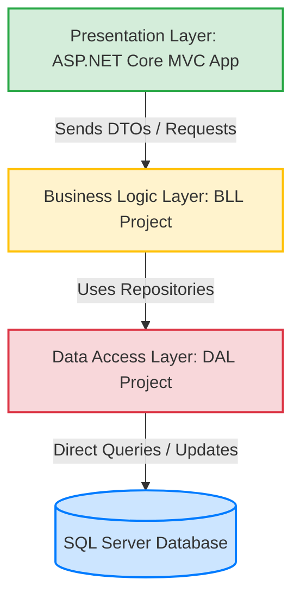
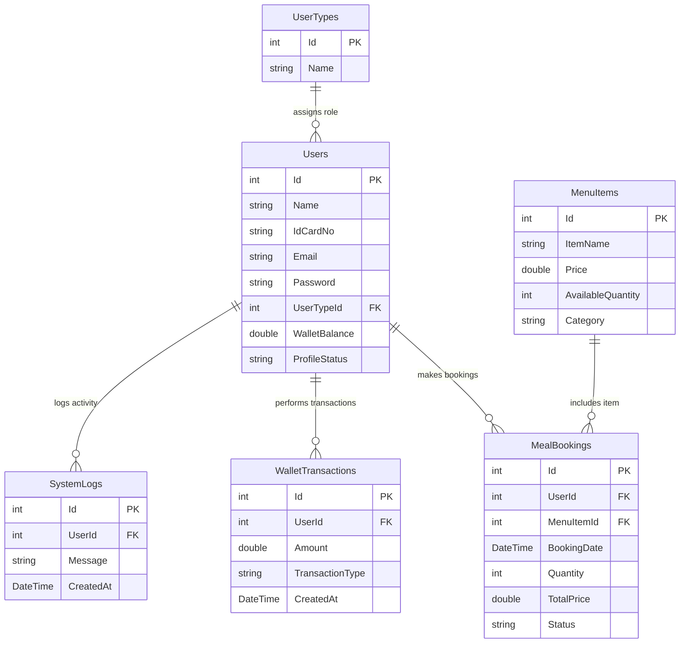

# Viva & Defense Technical Guide
### Cafeteria Management System (MVC & N-Tier Architecture)

This document contains a comprehensive breakdown of the application architecture, data access patterns, business logic flow, and common questions your professor might ask during the viva defense.

---

## 1. Architectural Blueprint (N-Tier Design)
The project strictly follows a **Three-Tier (N-Tier) Architecture** to ensure separation of concerns, maintainability, and security:

### Layer Breakdown:
1. **Presentation Layer (`App` project)**:
   * **Role**: Handles HTTP requests, manages user sessions, applies authorization filters, and renders views.
   * **Boundary Rule**: It has **no direct access** to the database context (`CafeteriaDbContext`) or raw entity classes. It communicates with the Business Logic Layer using Services and **DTOs (Data Transfer Objects)**.
2. **Business Logic Layer (`BLL` project)**:
   * **Role**: Houses the business rules, validation logic, and workflows (e.g., checking wallet balances before allowing a booking, refunding users, verifying transaction amounts, sorting recommended menu items).
   * **Mapping**: Uses **AutoMapper** to convert between database entity models (from the DAL) and UI-friendly DTOs.
3. **Data Access Layer (`DAL` project)**:
   * **Role**: Interacts directly with the SQL Server database via **Entity Framework Core**.
   * **Classes**: Contains the database context (`CafeteriaDbContext`), database tables/entity models, and **Repositories** (`UserRepo`, `MealBookingRepo`, etc.) that execute CRUD operations.

---

## 2. Data Access Layer (DAL) Details

### Database Schema & Relationships:
The SQL Server schema is designed around six tables, forming the core operational data structure:

### Repository Design Pattern:
* **Purpose**: Encapsulates data access code so that BLL services do not write Entity Framework linq queries directly.
* **Professors Code Convention**:
  * Every repository contains standard CRUD actions (`Create`, `Get`, `GetAll`, `Update`, `Delete`).
  * `db.SaveChanges()` returns the number of state entries written to the database. If greater than `0`, the operation was successful and returns `true`.

---

## 3. Key Viva Concepts & Questions

### Q1: Why do we use DTOs (Data Transfer Objects)? Why not send Entities directly to the View?
* **Security & Over-posting Protection**: Database entities contain sensitive columns (like `Password` hashes). Passing them directly to views exposes private details. DTOs restrict data exposure to only what the UI needs.
* **Separation of Concerns**: If the database schema changes, we only modify mapping configurations, leaving the views intact.
* **Validation**: Validation data annotations (e.g., `[Required]`, `[EmailAddress]`) can be customized on DTOs without polluting database schema entities.

### Q2: How does session-based authorization and filtering work?
* We use custom Action Filters: `[AdminAccess]` and `[CustomerAccess]`.
* Inside the filters (under `App/AuthFilters`), we implement `IAuthorizationFilter`:
  * We inspect the session: `context.HttpContext.Session.GetInt32("UType")`.
  * If the session is missing, or if the role ID does not match (e.g., `1` for Admin, `2` for Customer), we preemptively redirect the user to the Login page.

### Q3: Explain the User Deletion bug (the foreign key conflict with SystemLogs) and how it was fixed.
* **The Problem**: When a user registers, the system automatically logs a registration message in `SystemLogs` associated with that user's ID. When deleting a user, Entity Framework attempts to delete the row in the `Users` table. However, since the `SystemLogs` table foreign key doesn't have `ON DELETE CASCADE`, SQL Server blocks the deletion, throwing a database constraint error.
* **The Solution**: In `UserService.cs`'s `Delete` method, we first query all system logs associated with that user's ID and delete them via the `SystemLogRepo` before invoking `UserRepo.Delete`.

### Q4: Explain the Meal Booking model validation bug and how it was resolved.
* **The Problem**: `MealBookingDTO` has `Status` and `TotalPrice` properties marked as `[Required]`. Since these values are generated programmatically on the backend (balance calculations, default `"Pending"` status) and are not fields filled out by the user on the form, `ModelState.IsValid` failed and returned the view without submitting.
* **The Solution**: In `AdminController.cs`, we programmatically remove these validations using `ModelState.Remove("Status")` and `ModelState.Remove("TotalPrice")` before executing the validation check.

### Q5: How is your date-based refund/cancellation feature implemented?
* In `MealBookingService.cs`'s `CancelAndRefundEntireDay(DateTime date)`:
  1. We retrieve all bookings matching the specified date.
  2. For each booking, we find the corresponding user.
  3. We add the booking's `TotalPrice` back to the user's `WalletBalance`.
  4. We record a new refund transaction in `WalletTransactions`.
  5. We delete the booking record to free up stock and restore resources.
  6. All changes are saved atomically.

### Q6: How does the menu recommendation algorithm work?
* In `MenuItemService.cs`'s `GetRecommendedMenu(int userId)`:
  1. We analyze the user's past booking history to identify their most frequently ordered item categories.
  2. We sort all available menu items such that items belonging to their favorite category appear at the top of the menu, followed by other categories.
  3. If the user has no booking history (new user), we fall back to sorting by stock quantity to show popular available items first.

---

## 4. Quick Architecture Cheat Sheet for the Presentation

| Term / Component | Purpose | Location |
| :--- | :--- | :--- |
| **`CafeteriaDbContext`** | The EF database gateway | `DAL/EF/CafeteriaDbContext.cs` |
| **`UserRepo.cs`** | Handles direct database operations on `Users` table | `DAL/Repos/UserRepo.cs` |
| **`UserService.cs`** | Contains business logic for account management | `BLL/Services/UserService.cs` |
| **`MapperConfig.cs`** | Configures mappings between DTOs and Database Entities | `BLL/MapperConfig.cs` |
| **`AdminAccess.cs`** | Filters requests to make sure only logged-in Admins access actions | `App/AuthFilters/AdminAccess.cs` |
| **`Session`** | Stores `UserId`, `Uname`, and `UType` across HTTP requests | Configured in `App/Program.cs` |
| **`TempData`** | Passes feedback notifications (like "Created Successfully") between redirects | ASP.NET Core MVC |
